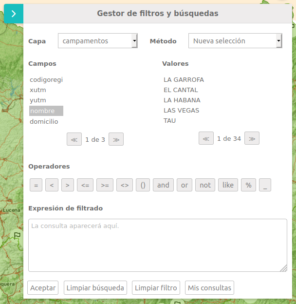

# M.plugin.FilteredSearch

Plugin que permite aplicar filtros sobre las capas de un mapa y visualizar de forma gráfica las features que cumplen los filtros. Permite guardar consultas, combinarlas y exportar los resultados de estas.



## Dependencias

- filteredsearch.ol.min.js
- filteredsearch.ol.min.css


```html
 <link href="../../plugins/filteredsearch/filteredsearch.ol.min.css" rel="stylesheet" />
 <script type="text/javascript" src="../../plugins/filteredsearch/filteredsearch.ol.min.js"></script>
```

## Parámetros

- El constructor se inicializa con un JSON de _options_ con los siguientes atributos:

- **position**. Indica la posición donde se mostrará el plugin
    - 'TL':top left
    - 'TR':top right (default)
    - 'BL':bottom left
    - 'BR':bottom right
    
## Ejemplos de uso

### Ejemplo 1
```javascript
   const map = M.map({
     container: 'map'
   });

   const mp = new M.plugin.FilteredSearch({
        position: 'TR',
   });

   map.addPlugin(mp);
```

